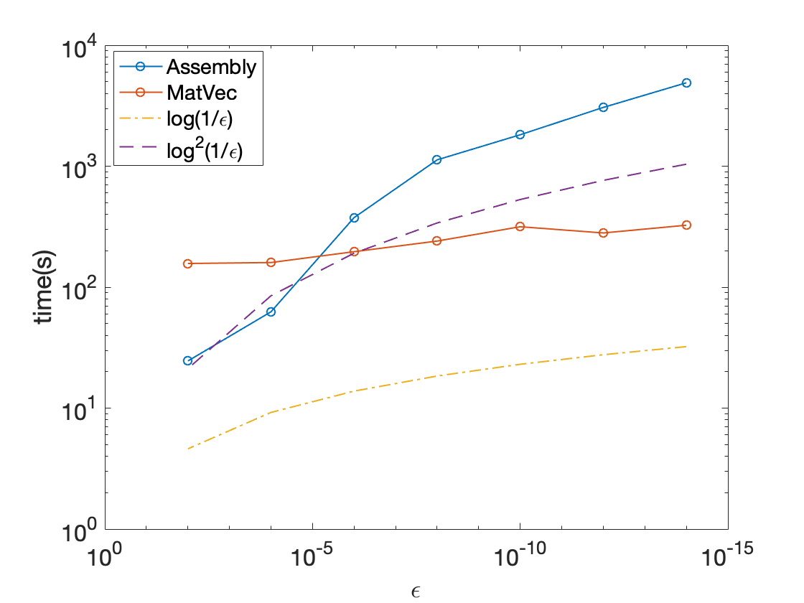
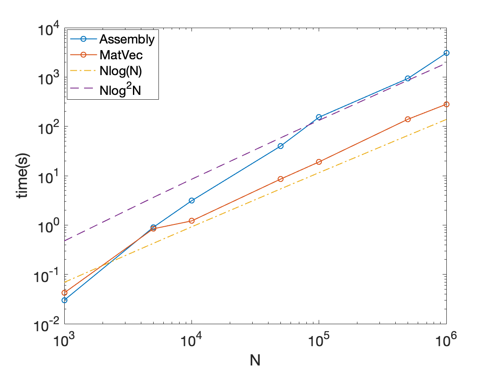

Benchmarks
^^^^^^^^^^

All the following benchmarks have been carried out on a 2.3 GHz Intel Core i5 processor with 8GB RAM (with OpenMP enabled, this is 4 threads), with g++-9 compiler and Eigen version 3.3.7. The compiler flags that were utilized are the same are those mentioned in the CMakeLists.txt file.

Time Taken vs Tolerance
~~~~~~~~~~~~~~~~~~~~~~~

These benchmarks were performed for size of the matrix :math:`N = 1000000`, with atmost :math:`M = 100` particles or nodes in a leaf box.

+----------------+------------+---------+
|Tolerance       | Assembly(s)|MatVec(s)|
+================+============+=========+
|:math:`10^{-2}` |  12.1156   | 6.97508 |
+----------------+------------+---------+
|:math:`10^{-4}` |  22.649    | 6.79404 |
+----------------+------------+---------+
|:math:`10^{-6}` |  94.8494   | 8.81189 |
+----------------+------------+---------+
|:math:`10^{-8}` |  221.221   | 35.9898 |
+----------------+------------+---------+
|:math:`10^{-10}`|  502.092   | 60.7432 |
+----------------+------------+---------+
|:math:`10^{-12}`|  795.797   | 87.0883 |
+----------------+------------+---------+
|:math:`10^{-14}`|  1278.38   | 126.954 |
+----------------+------------+---------+

Time Taken vs Size of Matrix
~~~~~~~~~~~~~~~~~~~~~~~~~~~~

For these benchmarks, the leaf size is atmost :math:`M = 100`, with tolerance set to :math:`10^{-12}`

+-----------------------+------------+------------+
|:math:`N`              | Assembly(s)|MatVec(s)   |
+=======================+============+============+
|:math:`10^{3}`         | 0.034163   | 0.00362    |
+-----------------------+------------+------------+
|:math:`5 \times 10^{3}`| 1.05146    | 0.029745   |
+-----------------------+------------+------------+
|:math:`10^{4}`         | 2.95279    | 0.046561   |
+-----------------------+------------+------------+
|:math:`5 \times 10^{4}`| 27.0407    | 0.389191   |
+-----------------------+------------+------------+
|:math:`10^{5}`         | 89.297     | 1.67967    |
+-----------------------+------------+------------+
|:math:`5 \times 10^{5}`| 336.318    | 38.3148    |
+-----------------------+------------+------------+
|:math:`10^{6}`         | 795.797    | 87.0883    |
+-----------------------+------------+------------+

